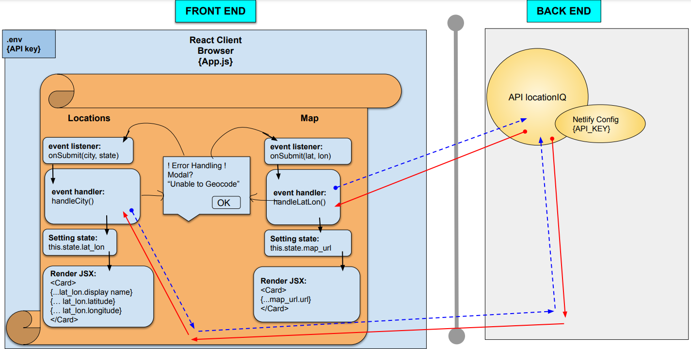
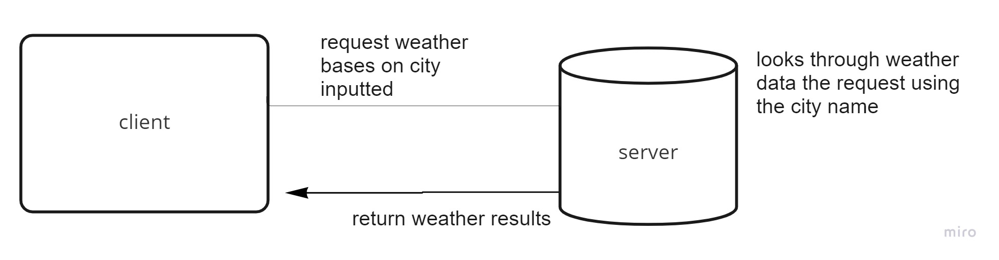
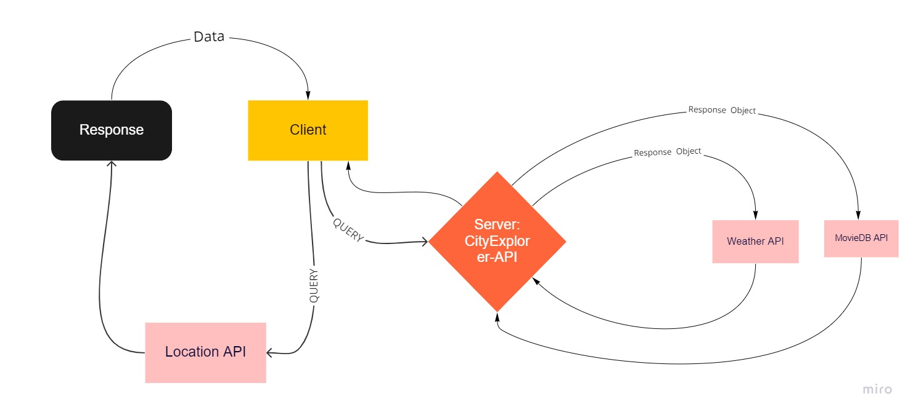
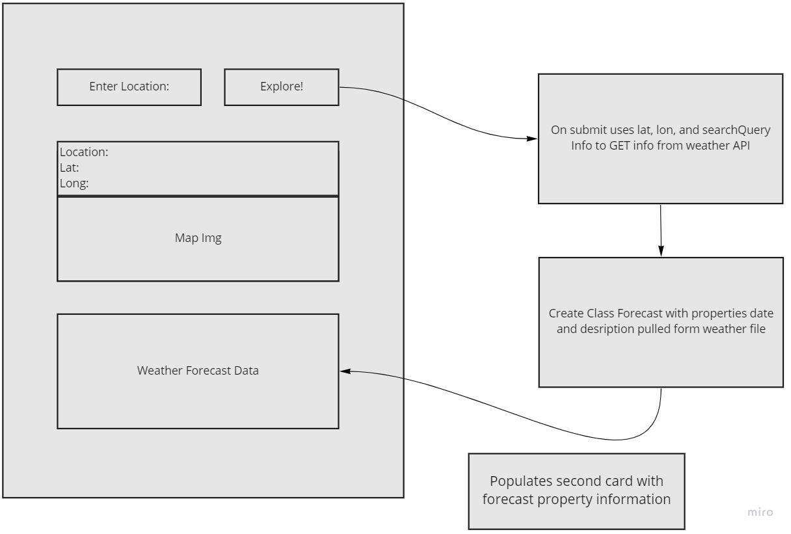
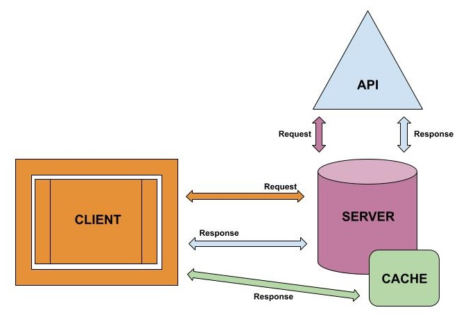

> # City Explorer

- **Author**: Andrew Schiller
- **Version**: 1.0.0 (increment the patch/fix version number if you make more commits past your first submission)

> ## Overview

This app lets you explore aspects of different cities located all around the U.S. Just put in a valid name, and start exploring!

> ## Getting Started

Simply visit
<!-- What are the steps that a user must take in order to build this app on their own machine and get it running? -->

> ## Architecture

- ### core languages: HTML/CSS/JavaScript

- ### library: [React Bootstrap](https://react-bootstrap.github.io/getting-started/introduction)

- ### API: [LocationIQ](https://locationiq.com/docs#search-forward-geocoding)

- ### misc: [Axios](https://www.npmjs.com/package/axios)

<!-- Provide a detailed description of the application design. What technologies (languages, libraries, etc) you're using, and any other relevant design information. -->

> ## Change Log

- Name of feature: City name to get lat and long
- Estimated ETA: 60 minutes
- Start time: 10pm
- Finish time: 11:15pm
- Actual ETA: 75 mins

<!-- Use this area to document the iterative changes made to your application as each feature is successfully implemented. Use time stamps. Here's an example:

01-01-2001 4:59pm - Application now has a fully-functional express server, with a GET route for the location resource. -->

> ## Credit and Collaborations

- [Jonathan Rumsey](https://github.com/nojronatron) assisted with the Lab 6 data flow
- Abdulahi contributed to the Lab 7 data flow
- Roger Reyes contributed to the Lab 9 data flow
- Jason Wilson contributed to the Lab 10 data flow